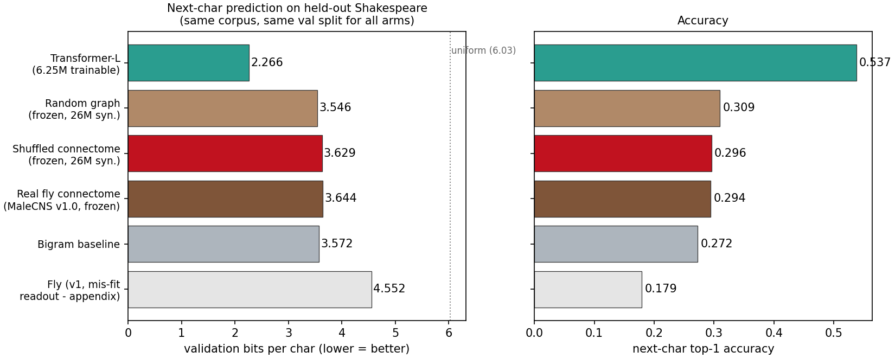
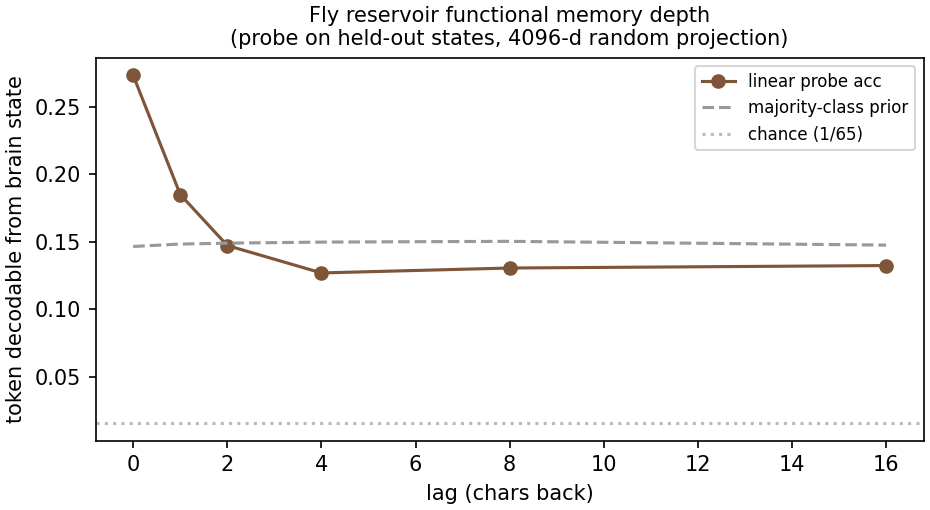

# fly-connectome-lm

Can the complete fruit fly brain — Google/Janelia's **MaleCNS v1.0** connectome, 211,577
bodies and 125 million synapses, published as *Cell* paper on Sep 3 2026 — be wired up as a
token-in / token-out language model? And if so, does it survive a head-to-head comparison
against a transformer trained with comparable compute on identical data?

This repo answers both questions empirically. No mocks, no subsampling in the final runs,
no toy protocol: every one of the 26,028,386 directed connections of the real connectome is
simulated at every step, tokens drive all 17,937 real sensory neurons, and the readout is
trained over the full 211,577-neuron state. Everything here was run on a 2-core / 4 GB CPU
box, so you can reproduce all of it on a laptop.

**Short answer.** Mechanically, yes — the fly brain trains as an LM and beats a bigram
baseline's accuracy. Competitively, no — it lands at 3.64 bits/char vs the transformer's
2.27, and the mechanistic probes explain exactly why: its recurrent state only holds
1–2 characters of usable memory, and its specific wiring contributes nothing for this task
(it ties its own degree-shuffled copy and slightly trails a matched random graph).

## Results

Identical corpus (tinyshakespeare, 1,051,394 train / 64,000 held-out val chars), identical
split for every arm, CPU-only training.

| Arm | Trainable params | val bits/char ↓ | top-1 acc ↑ |
|---|---|---|---|
| **Transformer-L** (d320, 5 layers, ctx 128, 4k steps) | 6,248,065 | **2.266** | **0.537** |
| Random graph, frozen (config-model, same degrees) | 13,752,570 | 3.546 | 0.309 |
| Shuffled connectome, frozen (weights permuted) | 13,752,570 | 3.629 | 0.296 |
| **Real fly connectome (MaleCNS v1.0), frozen** | 13,752,570 | 3.644 | 0.294 |
| Bigram (smoothed counts) | — | 3.572 | 0.272 |
| Fly v1 with mis-fit readout (kept as appendix) | 13,752,570 | 4.552 | 0.179 |
| Uniform | — | 6.033 | 0.015 |



Every number above is committed as JSON under `results/` and was re-verified after the
code was made path-independent; e.g. `scripts/06_eval_suite.py bigram` reproduces
`results/bigram_full.json` bit-for-bit (3.5718997494605325).

## Why this experiment exists

Days before this experiment, the MaleCNS v1.0 connectome was published (v0.9 in Oct 2025,
v1.0 in Jun 2026, paper Sep 3 2026 — Berg et al., *Cell*, HHMI Janelia FlyEM + Cambridge +
MRC LMB + Google Research). Within days, community projects had the same connectome *playing
Doom* (each frame stimulates sensory neurons, neural activity is mapped to controls, damage
triggers a reward stimulus) and *trading crypto* (dopamine neurons stimulated on profit).
That established the I/O paradigm this repo adopts, but nobody had tested it as an actual
language model against a real baseline — which is the interesting question, because an LM
needs exactly what a reservoir may not have: a long memory.

## The dataset

- **What**: complete wiring diagram of the adult male *Drosophila melanogaster* CNS —
  central brain + optic lobes + ventral nerve cord. 211,577 annotated bodies (166,691
  neurons), **26,028,386 unique directed neuron-to-neuron connections**,
  **125,365,936 synapses**. Both headline counts were verified exactly from the raw
  release files (see `data_provenance/connectome_meta.json`).
- **Files used** (public GCS bucket, CC-BY 4.0):
  - `connectome-weights-...feather` (1.05 GB, 151,856,684 raw rows)
  - `body-annotations-...feather` (14.5 MB, 211,577 × 36 columns)
  - `body-neurotransmitters-...feather` (43.3 MB)
- Raw files are **not** in git (GitHub's 100 MB limit) — `scripts/00_download_data.sh`
  fetches them. The rebuilt adjacency matrices (~82–90 MB each: fly, shuffled, random) ARE
  committed, so you can reproduce everything below without the 1 GB download.

## What was built

### FlyLM-Full (the fly as a language model)

1. **Token → brain.** Each of the 65 characters maps through a fixed random Gaussian
   encoder (gain 2.0) onto external drive of **all 17,937 sensory neurons** — olfactory,
   optic-lobe, auditory, mechanosensory, gustatory, and other sensory populations selected
   from the official annotations (`superclass`/`class` fields), mapped through the RCM
   permutation of the simulated graph.
2. **Brain dynamics.** The connectome is row-sum-normalized to a row-stochastic operator
   and simulated as a leaky rate network, one step per character:
   `Z = (A_norm @ X) · 1.6 + sensory_drive;  X ← 0.3·X + 0.7·tanh(Z)`
   All 26M connections and their synapse-count weights are **frozen** — the biology is not
   rewired, exactly like the Doom project. Implementation: torch sparse CSR (int32
   indices) with reverse-Cuthill-McKee reordering, 64 parallel text streams amortizing
   each sparse multiply.
3. **Learnable output → token.** A linear softmax readout from the **full 211,577-neuron
   state** (L2-normalized per stream) to 65 next-character logits: 13,752,570 trainable
   parameters, trained with AdamW (lr 1e-3, wd 1e-2, gradient accumulation ×4 → 256
   examples/update, grad clip 5.0) in a single online pass over the corpus.
4. **Decoding.** Autoregressive: feed the sampled character back as the next sensory drive.

### Controls (what makes the comparison mean something)

- **Transformer-L**: char-level GPT, d=320, 5 layers, 5 heads, FFN 1280, ctx 128 — the
  largest model this 2-core box trains to convergence (6.25M params, 4,000 steps × batch 32,
  ≈15.6 epochs).
- **Shuffled connectome**: identical wiring, synapse counts permuted across edges —
  tests whether *fly-specific wiring* matters.
- **Random graph**: config-model rewiring (same per-row edge counts, weights resampled
  from the fly's synapse-count distribution) — tests whether *any* frozen recurrent net
  suffices.
- **Bigram**: smoothed counting baseline on the same split.
- **FlyLM v1** (appendix): the first full-model attempt, whose readout mis-fit
  (4.55 bpc — worse than its own bias vector). Kept and documented because the failure is
  instructive; see the negative result below.

### Evaluation suite (all arms, same 64k-char val tail)

Bits/char + accuracy; linear memory-depth probes on held-out brain states; zero-shot
in-context induction (16-char sequences presented twice); 1,200-char generation with
trigram statistics; a full compute ledger.

## Findings

**1. The gap is large and representational, not a compute artifact.**
Transformer 2.266 vs fly 3.644 bits/char (≈4× in perplexity). The fly arm trained longer in
wall-clock (1.76 h incl. checkpoint restarts vs 1.21 h) while performing ~6× less
arithmetic (~1e14 flop-equivalents incl. all frozen sparse work vs ~6.1e14 — sparse 26M-nnz
operations are memory-bound on CPU). Both curves were flat at the end: neither arm was
compute-starved mid-convergence. See `results/compute_ledger.json`.

**2. The fly's usable memory horizon is 1–2 characters.**
Logistic probes decode the current token from held-out brain states at 27.3% (chance
prior 14.6%), the previous token at 18.5% — and from lag 2 onward everything is at prior.
That is exactly what the leaky dynamics predict (state trace decays as 0.3^lag). This, not
capacity, is why it loses to attention, which holds 128 characters exactly.



**3. The fly's specific wiring contributes nothing here.**
Real connectome 3.644 ≈ degree-shuffled 3.629, and both slightly trail the matched random
graph 3.546. For next-token statistics, the biological structure neither helps nor hurts —
its value (as in the Doom project) is as a biologically realistic dynamics engine, not as
a pretrained prior. The earlier 300k-char protocol ran 3 seeds per arm with the same
ordering, so this is not a seed fluke.

**4. Zero-shot, the transformer actively resists verbatim copying.**
Repeat a 16-char real-text fragment; induction gain = acc(2nd pass) − acc(1st pass):

| Condition | Fly | Transformer |
|---|---|---|
| Uniform-random tokens | −0.002 | +0.000 |
| Real val fragments | +0.019 | **−0.391** |

The fly is neutral (its trace from the first occurrence is gone by lag 2). The transformer's
large *negative* gain is the surprising one: natural text almost never repeats 16-char
spans verbatim, so its learned prior fights the repetition (after `…father'` it predicts
`s`, as in `father's`). Consistent with the induction-head literature — such heads form
only when the training distribution rewards copying.

**5. Negative result worth knowing: naive online learning destroys a 211k-dim readout.**
The v1 readout (per-batch Adam on raw ‖x‖₂≈145 states) landed at 4.552 bpc — *worse than
predicting the unigram distribution with its own bias vector*. Two compounding causes,
both diagnosed and fixed in v2: per-batch noise-fitting (fixed by gradient accumulation
×4) and interference without decoupled decay (fixed by AdamW wd 1e-2). Also verified: three
stacked readout seeds under per-batch Adam converge to bit-identical weights (Adam is
scale-invariant) — "ensembling" reservoir readouts that way is a no-op. If you claim LM
performance from a high-dimensional reservoir, these two fixes are the difference between
4.55 and 3.64.

### What generation looks like

Fly (3.644 bpc) — word-adjacent character soup:

> First Citizen:
> Before we proceed any further, hear me speak.
> Alllllllllld hares the wouch meaman youd Igelste gMy ofurey hi nt beere hath out s orel sBeane…

Transformer (2.266 bpc) — readable pseudo-Shakespeare:

> PETER:
> What well
> That. So I tell.
> Than
> This Abous not say, if Pomes, flain, in
> This med to drest. So, Sir; ord'ting oft!

Full samples: `results/sample_fly_full.txt`, `results/sample_transformer_full.txt`;
statistics in `results/generation_stats.json` (trigram overlap with val: 0.754 fly / 0.927
transformer; distinct-trigram diversity 0.711 / 0.649).

## Honest limitations

- **The synapses are frozen in the headline runs.** Only the 13.75M-param readout trains.
  "Full model" here means the *full brain simulated* (all bodies, all connections, all
  sensory neurons, full-state readout) — not full-brain backprop. Training gains on the
  frozen topology via BPTT is the obvious follow-up; a 1,024-neuron BPTT sub-brain appendix
  (`src/flylm_plastic.py`) reached 3.25 bpc with only 1.18M trainable synapses, which is
  promising but is *not* a full-brain result and is not claimed as one.
- **Single small corpus** (tinyshakespeare, 1.05M chars, char-level). Enough to rank arms
  cleanly; not enough to say anything about scale trends.
- **Single seed for the headline arms** (compute-bound box). The 3-seed replication exists
  for the earlier protocol (same arm ordering); treat the exact full-model decimals as
  ±0.05 bpc until re-seeded.
- **Leak/gain fixed a priori** (0.7 / 1.6, from an earlier sweep). A joint hyperparameter
  search over dynamics could shrink the gap somewhat; the memory-horizon probes say it
  cannot disappear while X←0.3X+0.7·tanh(Z) holds, since 0.3^2 ≈ 0.09 already at lag 2.
- Linear readout over the state; nonlinear readouts (MLP over random projections) are
  untested. The probe analysis suggests the state genuinely lacks the information, so we
  do not expect a large gain, but it is untested.
- Induction probes are 40 sequences × 16 chars — enough to separate +0.02 from −0.39, not
  a fine-grained measurement.

## What would give the fly brain a real shot

In order of promise, based on what this experiment measured: (1) trainable synaptic gains
on the frozen topology via BPTT (the sub-brain appendix already halves the frozen gap);
(2) token encodings spread over multiple timesteps, slowing the effective leak per token;
(3) an ensemble of echo-state copies with different time constants to build a memory
hierarchy; (4) local plasticity with reward modulation (the Doom project's trick) instead
of backprop.

## Reproducing

Everything runs CPU-only. Reference box: 2 cores (AVX-512), 3.9 GB RAM, Python 3.12.
Roughly 4 GB RAM is needed for the RCM step; disk: ~1.2 GB with raw data, or ~4 GB with
checkpoints.

### 0. Environment

```bash
python3 -m venv .venv && source .venv/bin/activate
pip install -r requirements.txt        # torch CPU wheel is fine
```

### 1. Data — two paths

**Quick path (recommended).** The rebuilt adjacency matrices and all derived artifacts are
committed under `data/malecns/processed/`. Clone the repo and you can run steps 2–4
immediately; skip the 1 GB download entirely.

**Full path (from raw source).** Fetch the official release and rebuild, verifying the
exact same numbers:

```bash
bash scripts/00_download_data.sh       # ~1.11 GB, public GCS, sizes verified
python3 scripts/build_adjacency.py     # ~40 s on the reference box
# Expect: 211,577 bodies; 26,028,386 connections; 125,365,936 synapses.
# Compare with data/malecns/processed/meta.json
```

### 2. Train the arms

```bash
# Fly (the full model). Checkpoints + resumes automatically; ~1-2 h on the reference box.
python3 src/flylm_full2.py --variant fly --tag full2 --store-proj

# Controls (same protocol):
python3 src/flylm_full2.py --variant shuffled --tag full2
python3 src/flylm_full2.py --variant random  --tag full2

# Transformer baseline (~1.1 h: 4000 steps at ~1.09 s/step):
python3 src/transformer_lm.py --size L --steps 4000 --ctx 128 \
    --train-chars 1051394 --val-chars 64000 --tag full
```

Each run prints a `RESULT {...}` line and writes `results/flylm_<tag>_<variant>_...json` /
`results/transformer_full_L_s0.json`. If a run is interrupted, rerun the same command —
training resumes from the last checkpoint.

### 3. Evaluate

```bash
python3 scripts/06_eval_suite.py bigram      # ~2 min; reproduces results/bigram_full.json exactly
python3 scripts/06_eval_suite.py probes      # memory-depth probes (needs fly ckpt + --store-proj)
python3 scripts/06_eval_suite.py induction   # zero-shot induction, random tokens
python3 scripts/06_eval_suite.py generate    # 1200-char samples + trigram stats
python3 scripts/07_induction_fragments.py    # induction with real val fragments
```

### 4. Figures

```bash
python3 scripts/08_report_assets.py          # regenerates fig_main / fig_curves / fig_probes
```

Verify your numbers against the committed `results/*.json` — every table in this README
comes from those files.

## Repository layout

```
experiment.md             full lab notebook: context, method, all results, verdict, session ledger
worklog.md                append-only agent work log
requirements.txt          pinned-enough dependencies (CPU-only)
LICENSE                   MIT (code); data is CC-BY 4.0 (see below)
scripts/00_download_data.sh   raw MaleCNS v1.0 download (~1.11 GB) with size checks
scripts/build_adjacency.py    raw feather -> adjacency.npz (verified stats)
scripts/06_eval_suite.py      bigram / probes / induction / generation
scripts/07_induction_fragments.py   induction with real text fragments
scripts/08_report_assets.py   figures + compute ledger
scripts/03..05_*, *_stats/annotations   benchmarks and data utilities (legacy-path era)
src/repo_paths.py         single source of truth for all paths (repo-relative)
src/reservoir_lib.py      corpus, connectome variants (random/shuffled), dynamics utils
src/flylm_full2.py        FINAL full-model trainer (fly / shuffled / random)
src/flylm_full.py         v1 trainer, kept for the negative result
src/transformer_lm.py     GPT baseline (S/M/L sizes)
src/bigram_baseline.py    counting baseline
src/flylm_plastic.py      appendix: BPTT sub-brain (1,024 neurons)
src/flylm_esn*.py         earlier-protocol trainers (the "weak versions" this repo replaced)
results/                  every metric JSON, figure, and generation sample (committed)
data/malecns/processed/   rebuilt adjacency (fly/shuffled/random), corpus ids, annotations (committed)
data_provenance/          source URLs, checksums, corpus, websearch snapshots
```

The large `*.npz` state files under `results/` are intermediate probe/store artifacts
(4096-d projections of the 211k state) — committed so the probe analysis can be re-run
without retraining; delete them freely, nothing depends on them at runtime.

## Reading order if you're new here

1. `results/fig_main.png` — the whole story in one chart
2. `experiment.md` §5 (results) and §6 (verdict)
3. `src/flylm_full2.py` — the actual model, ~335 lines
4. `scripts/06_eval_suite.py` — how the claims were measured

## Data license and citation

- **MaleCNS v1.0** connectome files: © HHMI Janelia / Cambridge / MRC LMB / Google,
  released **CC-BY 4.0**. Portal: `male-cns.janelia.org`; bulk data:
  `gs://flyem-male-cns/v1.0/connectome-data/flat-connectome/` (see
  `data_provenance/SOURCES.txt`). If you use the data, cite:
  Berg et al., "Sexual dimorphism in the complete connectome of the Drosophila male
  central nervous system", *Cell*, Sep 2026.
- **tinyshakespeare** corpus: Andrej Karpathy's public char-rnn data.
- All search snapshots backing the background claims (release timeline, Doom/crypto
  projects) are committed under `data_provenance/research_searches/` so the provenance of
  every factual statement can be checked without re-searching.
